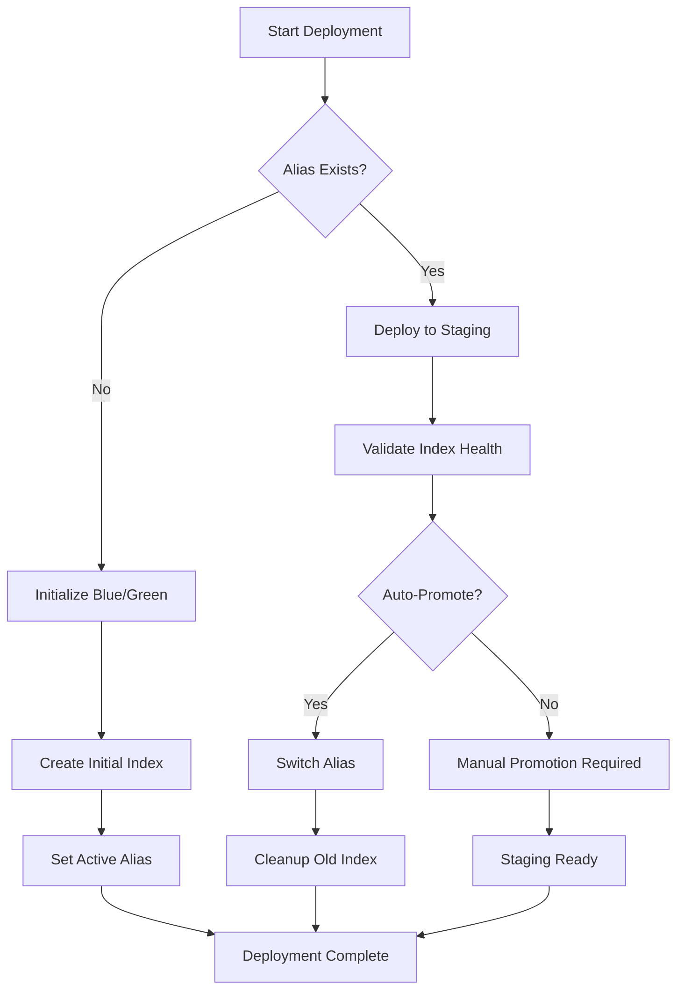

# E4Dynamics Blue/Green Batch API

A TypeScript/Node.js API for session-based batch processing with zero-downtime blue/green deployments, optimized for large-scale product ingestion (millions of products).

## 📋 Table of Contents

- [Overview](#overview)
- [Features](#features)
- [Architecture](#architecture)
- [Installation](#installation)
- [API Endpoints](#api-endpoints)
- [Batch Session Workflow](#batch-session-workflow)
- [Usage Examples](#usage-examples)
- [Development](#development)
- [Testing](#testing)
- [Project Structure](#project-structure)

## 🎯 Overview

This API provides a session-based batch processing system for managing Elasticsearch indices with zero-downtime blue/green deployments. It's specifically designed for large-scale product data ingestion, supporting millions of products through efficient batch operations.

### Key Capabilities

- **Session-based batch processing** for large datasets
- **Zero-downtime deployments** using blue/green strategy
- **Resumable operations** with session state management
- **RESTful API** with comprehensive Swagger documentation
- **Optimized for scale** - handles millions of products efficiently
- **Error recovery** and status monitoring

## ✨ Features

### Core Features
- 🔄 **Session-based Batching**: Start, process, complete, and monitor batch sessions
- 🏥 **Health Monitoring**: Index validation and deployment status
- 📊 **Large-scale Processing**: Optimized for millions of products
- 🔧 **Blue/Green Management**: Automatic staging and promotion
- 📚 **API Documentation**: Interactive Swagger UI
- 🧪 **Testing**: Comprehensive test suite

### Advanced Features
- 🎯 **Resumable Sessions**: Continue interrupted batch operations
- 🔍 **Status Tracking**: Real-time progress and error monitoring
- ⚡ **Efficient Processing**: Optimized batch sizes and parallel processing
- 🛡️ **Error Handling**: Robust error recovery and session cleanup
- 📈 **Progress Monitoring**: Track documents processed and remaining
- 🔄 **Session Management**: List, cancel, and clean up active sessions

## 🏗️ Architecture

The project follows a session-based batch processing architecture:

```
┌─────────────────────────────────┐
│        Batch Session API       │
│    (Session Lifecycle Mgmt)    │
├─────────────────────────────────┤
│      Session Manager Core      │
│   (State, Progress, Cleanup)   │
├─────────────────────────────────┤
│     Blue/Green Deployment      │
│  (Index Creation & Promotion)  │
├─────────────────────────────────┤
│      Elasticsearch Client      │
│    (@elastic/elasticsearch)    │
└─────────────────────────────────┘
```

### Key Components

- **Batch Session Manager**: Orchestrates session lifecycle and state
- **Session State Tracking**: Manages progress, errors, and timeouts
- **Blue/Green Deployment**: Handles index creation and promotion
- **Progress Monitoring**: Tracks document processing and errors
- **Cleanup Management**: Automatic session timeout and cleanup

## 🚀 Installation

### Prerequisites

- Node.js 18+ 
- Elasticsearch 8.x
- npm or yarn

### Setup

1. **Clone the repository**
   ```bash
   git clone <repository-url>
   cd e4dynamics-elasticsearch
   ```

2. **Install dependencies**
   ```bash
   npm install
   ```

3. **Configure Elasticsearch**
   ```bash
   # Set Elasticsearch URL (optional, defaults to http://localhost:9200)
   export ELASTICSEARCH_URL=http://your-elasticsearch:9200
   ```

4. **Build and start**
   ```bash
   npm run build
   npm run api
   ```

## 📡 API Endpoints

### System Health

#### Health Check
```
GET /health
```
Returns API and Elasticsearch health status.

### Batch Session Management

#### Start Batch Session
```
POST /api/batch/sessions/{alias}/start
```
Initiates a new batch processing session for blue/green deployment.

**Parameters:**
- `alias` (path): The alias name for the deployment
- `strategy` (query): Deployment strategy (`SAFE`, `AUTO_SWAP`)
- `estimatedTotal` (query): Estimated total documents (optional)

**Request Body:**
```json
{
  "strategy": "SAFE",
  "estimatedTotal": 1000000
}
```

**Response:**
```json
{
  "sessionId": "uuid-v4",
  "alias": "products",
  "targetIndex": "products_green_20241220_143022",
  "targetColor": "green",
  "status": "active"
}
```

#### Process Batch
```
POST /api/batch/sessions/{sessionId}/process
```
Processes a batch of documents within an active session.

**Request Body:**
```json
{
  "documents": [
    {
      "RecordId": 1,
      "name": "Product 1",
      "price": 29.99,
      "rules": {
        "isActiveInSalesProcess": true
      }
    }
  ]
}
```

#### Complete Session
```
POST /api/batch/sessions/{sessionId}/complete
```
Marks a batch session as complete and ready for promotion.

#### Get Session Status
```
GET /api/batch/sessions/{sessionId}/status
```
Returns current session status and progress.

**Response:**
```json
{
  "sessionId": "uuid-v4",
  "alias": "products",
  "status": "active",
  "totalBatches": 50,
  "processedBatches": 30,
  "totalDocuments": 1000000,
  "processedDocuments": 600000,
  "failedDocuments": 150,
  "errors": [],
  "createdAt": "2024-12-20T14:30:22Z"
}
```

#### Cancel Session
```
DELETE /api/batch/sessions/{sessionId}
```
Cancels an active batch session and cleans up resources.

#### List Active Sessions
```
GET /api/batch/sessions
```
Returns all currently active batch sessions.

### Blue/Green Operations

#### Promote Deployment
```
POST /api/batch/sessions/{sessionId}/promote
```
Promotes a completed session to production by switching aliases.

#### Get Deployment Status
```
GET /api/blue-green/{alias}/status
```
Returns current blue/green deployment status.

## 🔄 Blue/Green Deployment

### Deployment Strategies

1. **Safe Strategy** (Default)
   - Deploys to staging index
   - Requires manual promotion
   - Maximum safety and control

2. **Auto-Swap Strategy**
   - Automatically promotes after validation
   - Faster deployments
   - Suitable for trusted data sources

3. **Blue-Only/Green-Only**
   - Forces deployment to specific color
   - Useful for maintenance scenarios

### Deployment Workflow



### Deployment States

- `IDLE`: No active deployment
- `DEPLOYING`: Creating and populating new index
- `READY_FOR_SWAP`: Staging index ready for promotion
- `SWAPPING`: Switching aliases
- `COMPLETED`: Deployment finished successfully
- `FAILED`: Deployment encountered errors
- `ROLLING_BACK`: Reverting to previous state

## 💡 Usage Examples

### Initialize a New Blue/Green Deployment

```bash
curl -X POST http://localhost:3000/api/blue-green/products/initialize?color=blue \
  -H "Content-Type: application/json" \
  -d '[
    {
      "RecordId": 1,
      "name": "Sample Product",
      "price": 29.99,
      "rules": {
        "isActiveInSalesProcess": true
      }
    }
  ]'
```

### Deploy Products with Auto-Promotion

```bash
curl -X POST "http://localhost:3000/api/blue-green/products/deploy?autoPromote=true" \
  -H "Content-Type: application/json" \
  -d @products.json
```

### Check Deployment Status

```bash
curl http://localhost:3000/api/blue-green/products/status
```

### Manually Promote Deployment

```bash
curl -X POST "http://localhost:3000/api/blue-green/products/promote?targetColor=green"
```

### Rollback Deployment

```bash
curl -X POST http://localhost:3000/api/blue-green/products/rollback
```

## 🛠️ Development

### Start Development Server

```bash
npm run api
```

The API will be available at `http://localhost:3000` with Swagger UI at `http://localhost:3000/api-docs`.

### Available Scripts

| Script | Description |
|--------|-------------|
| `npm run build` | Compile TypeScript to JavaScript |
| `npm run start` | Run compiled application |
| `npm run dev` | Run in development mode |
| `npm run api` | Start API server with ts-node |
| `npm test` | Run test suite |
| `npm run test:watch` | Run tests in watch mode |
| `npm run test:coverage` | Run tests with coverage report |
| `npm run test:blue-green` | Run blue/green deployment tests |

### Debugging

The project includes VS Code debugging configuration:

1. Set breakpoints in TypeScript files
2. Press `F5` or select "Debug Koa Server"
3. The debugger will attach and break at your breakpoints

## 🧪 Testing

### Running Tests

```bash
# Run all tests
npm test

# Run tests in watch mode
npm run test:watch

# Run with coverage
npm run test:coverage

# Run blue/green specific tests
npm run test:blue-green
```

### Test Categories

- **Unit Tests**: Test individual components and services
- **Integration Tests**: Test API endpoints and workflows
- **Blue/Green Tests**: Test deployment scenarios and edge cases

### Interactive Testing

```bash
# Run interactive blue/green test suite
npm run test:blue-green
```

This provides a menu-driven interface to test various deployment scenarios.

## 📁 Project Structure

```
src/
├── api/                          # API layer
│   ├── server.ts                 # Koa server setup
│   ├── blueGreenRoutes.ts       # Blue/green endpoints
│   └── productDataService.ts    # Product data loading
├── core/                         # Core services
│   ├── client/                   # Elasticsearch client
│   ├── deployment/               # Blue/green deployment logic
│   ├── indexing/                 # Document indexing
│   ├── management/               # Alias management
│   └── mapping/                  # Index mapping
├── product/                      # Product-specific logic
│   ├── models/                   # Product data models
│   ├── mapping/                  # Product index mapping
│   └── indexing/                 # Product indexing
├── __tests__/                    # Test suites
├── tester/                       # Interactive testing tools
└── mapping/                      # Shared mapping interfaces
```

### Key Files

- `src/api/server.ts`: Main API server with Koa and Swagger
- `src/core/deployment/blueGreenDeploymentManager.ts`: Core deployment logic
- `src/product/indexing/productIndexer.ts`: Product-specific blue/green indexer
- `src/api/blueGreenRoutes.ts`: Blue/green API endpoints
- `src/core/management/aliasManager.ts`: Elasticsearch alias operations

## 🏥 Health Monitoring

The system includes comprehensive health monitoring:

### Index Health Validation
- Document count verification
- Index status checking
- Cluster health monitoring

### Deployment Monitoring
- Real-time status updates
- Error tracking and reporting
- Performance metrics

### Alerting
- Failed deployment notifications
- Health check failures
- Resource usage warnings

## 🔒 Security Considerations

- **Input Validation**: All API inputs are validated
- **Error Handling**: Sensitive information is not exposed
- **Rate Limiting**: Consider implementing for production
- **Authentication**: Add authentication middleware as needed
- **HTTPS**: Use HTTPS in production environments

## 📊 Performance

### Optimization Features
- Batch processing for large datasets
- Configurable batch sizes
- Connection pooling
- Efficient alias switching

### Monitoring
- Index statistics tracking
- Deployment timing metrics
- Resource usage monitoring

## 🤝 Contributing

1. Fork the repository
2. Create a feature branch (`git checkout -b feature/amazing-feature`)
3. Commit your changes (`git commit -m 'Add amazing feature'`)
4. Push to the branch (`git push origin feature/amazing-feature`)
5. Open a Pull Request

### Development Guidelines

- Follow TypeScript best practices
- Add tests for new features
- Update documentation
- Use conventional commit messages
- Ensure all tests pass

## 📄 License

This project is licensed under the MIT License - see the LICENSE file for details.

## 🆘 Support

For support and questions:

1. Check the API documentation at `/api-docs`
2. Review the test examples in `src/__tests__/`
3. Use the interactive tester: `npm run test:blue-green`
4. Create an issue for bugs or feature requests

## 🚀 Deployment

### Production Checklist

- [ ] Configure production Elasticsearch cluster
- [ ] Set environment variables
- [ ] Enable HTTPS
- [ ] Configure monitoring and logging
- [ ] Set up health checks
- [ ] Configure backup strategies
- [ ] Implement authentication/authorization
- [ ] Set up CI/CD pipeline

### Docker Support

```dockerfile
# Example Dockerfile (create as needed)
FROM node:18-alpine
WORKDIR /app
COPY package*.json ./
RUN npm ci --only=production
COPY dist ./dist
EXPOSE 3000
CMD ["node", "dist/api/server.js"]
```

---

**Built with ❤️ using TypeScript, Koa.js, and Elasticsearch**
